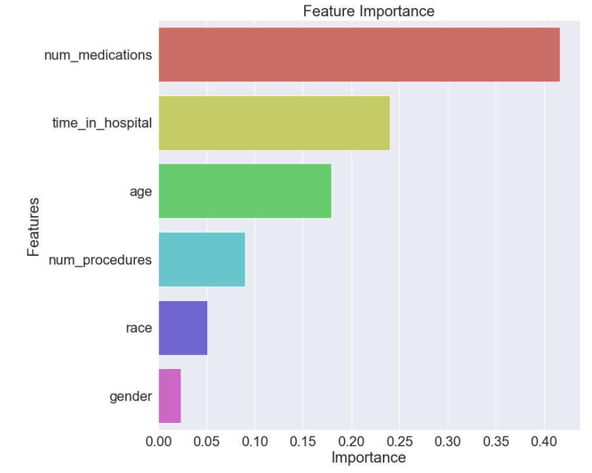
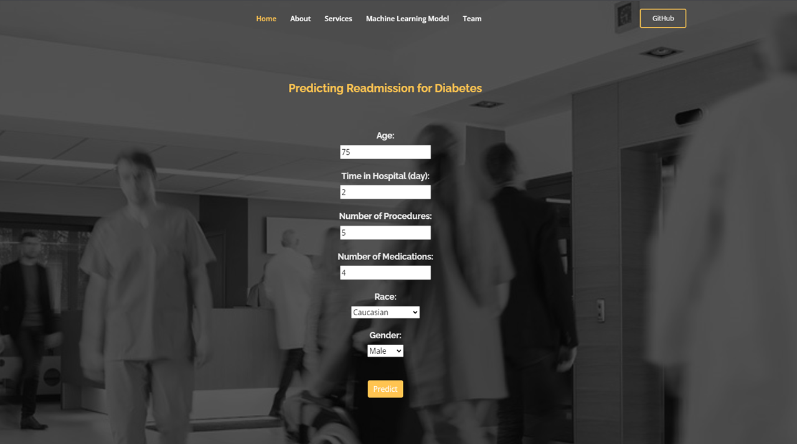

## Table of Contents
   =================

  1. [About](#about)
  2. [Background](#background)
  3. [Technologies](#technologies)
  4. [Approach](#approach)
  5. [Data Source](#data)
  6. [Architectural Diagram](#architectural)
  7. [Preprocessing](#preprocessing)
  8. [Compiling, Training and Evaluating the Model](#compiling)
  9. [Using the Model](#using)
  10. [Limitations](#limitations)
  11. [Next Steps](#next-steps)
  12. [Contributors](#contributors)

## About
Our team was interested in predicting hospital readmissions for diabetic patients. We focused on features that impact readmission within a 30 day period, based on the patient's state after being discharged from the hospital. We created an interactive application that predicts whether a patient is at high risk or low risk for being readmitted to a hospital within 30 days, using a random forest classification model.  

**Link**: [https://diabetes11.herokuapp.com/](https://diabetes11.herokuapp.com/)

## Background 
The cost of hospital readmission accounts for a large portion of hospital inpatient services spending. Diabetes is not only one of the top ten leading causes of death in the world, but also the most expensive chronic disease in the United States. Hospitalized patients with diabetes are at higher risk of readmission than those without diabetes. American hospitals spend over $41 billion on diabetic patients who are readmitted within 30 days of discharge. Being able to determine factors that lead to higher readmission in such patients, and predicting which patients will get readmitted can help hospitals save millions of dollars while improving quality of care. Therefore, reducing readmission rates for diabetic patients has great potential to reduce medical cost. 

## Technologies 
- Python (pandas, matplotlib, numpy, scikit-learn)
- Google Colab
- PostgreSQL
- Flask
- SQLAlchemy

## Technologies: 
- Python/Pandas/Sklearn
- Keras
- Google Colab
- PostgreSQL
- Flask
- HTML/CSS/Bootstrap
- Heroku 

## Approach
1. Identify data sources and dependencies
2. Perform EDA, determine feature set and transform diabetes data
3. Compile, train and evaluate the model
4. Compare models for optimization of accuracy metric
5. Iterate on models using SMOTE to address data imbalance
5. Serialize and deserialize model using Joblib
6. Create Flask App and load model
7. Visualize dashboard in Heroku

## Data Source
Data was collected from 130 US Hospitals from 1999 to 2008. The dataset contains 102k rows of data and 50 features. 

**Link**: [Data Source](https://www.kaggle.com/iabhishekofficial/prediction-on-hospital-readmission/data) 

## Architectural Diagram

## Preprocessing 
- Reduced the data set to six features: age, gender, time_in_hospital, num_procedures, num_medications, race
- Dropped null values
- Converted target value 'Readmitted' to binary classes
- Convert categorical data to numberic 
- Split the preprocessed data into training and testing sets
- Cross Validation/Shufflesplit
- Normalize data with StandardScaler

## Compiling, Training and Evaluating the Model
- Evaluated 5 models: Decision Tree Classifier, Random Forest Classiifier, KNN, Logistic Regression and Neural Network.  
- Used SMOTE to address imbalanced data 
- Random Forest model had the best performance, with 74% accuracy, best F1 score, confusion matrix and ROC curve
- Hypertuned the model which resulted in a small improvement of .15%
- Calculated distritution of accuracy scores across 50 splits to verify model
- Evaluated feature performance  

## Using the Model
Our website was built using Boostrap, custom HTML and CSS.  

To use the model, select a value for each feature. Based on values chosen, the model will predict whether a patient with selected features is at high or low risk for being readmitted to the hospital within 30 days. This site will be used by hospital staff to assess patience readmittance.

## Limitations 
- Limited time of project
- Data freshness (2008)

## Next Steps
- Evaluate further feautures, weight features, or consider models like AdaBoost or XGBoost
- Enable user input to continue to train our model  
- Consider potential bias in our data, especially related to demographic features

## Contributors
- Michelle Davis -  https://github.com/davism02
- Yingying Li - https://github.com/Yingying-Li-Data
- Grey Hardy -  https://github.com/ItsGreyedOut
- Lauren To -  https://github.com/laurenemilyto