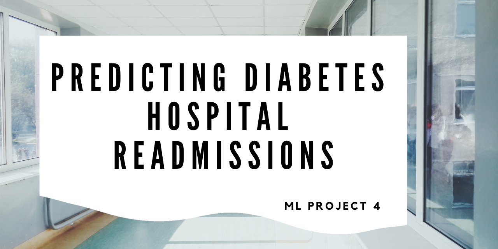
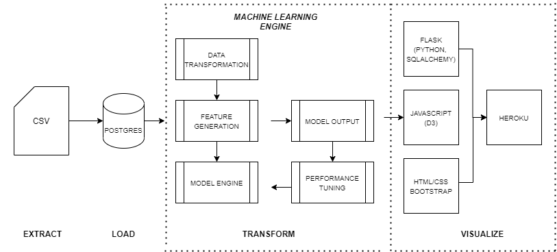

## About this Project:
Our team was interested in predicting hospital readmissions for diabetic patients. We focused on features that impact readmission within a 30 day period, based on the patient's state after being discharged from the hospital. 

## Background: 
The cost of hospital readmission accounts for a large portion of hospital inpatient services spending. Diabetes is not only one of the top ten leading causes of death in the world, but also the most expensive chronic disease in the United States. Hospitalized patients with diabetes are at higher risk of readmission than those without diabetes. American hospitals spend over $41 billion on diabetic patients who are readmitted within 30 days of discharge. Being able to determine factors that lead to higher readmission in such patients, and predicting which patients will get readmitted can help hospitals save millions of dollars while improving quality of care. Therefore, reducing readmission rates for diabetic patients has great potential to reduce medical cost. 

Link: 

## Technologies: 
- Python/Pandas/Sklearn
- Keras
- Google Colab
- PostgreSQL
- Flask
- HTML/CSS/Bootstrap
- Heroku 

## Approach: 
1. Identify data sources and dependencies
2. Perform EDA, determine feature set and transform diabetes data
3. Compile, train and evaluate the model
4. Compare models for optimization of accuracy metric
5. Serialize and deserialize model using joblib
6. Create Flask App and connect routes to model
7. Create interactive web app using Javascript D3, HTML and CSS
8. Visualize dashboard in Heroku

## Data Source
https://www.kaggle.com/iabhishekofficial/prediction-on-hospital-readmission/data 
Our dataset has 102k rows of data and 50 features. 

## Architectural Diagram

## Preprocessing the Data
- Reduced the data set to 6 features
- Check for and Dropped invalid values (?)
- Converted readmitted column to binary field
- Determine the number of unique values in each column.  Dropped colum (max_glu_serum) since there was only 1 unique value
- Convert categorical data to numberic with 'pdget_dummies' - one hot encoding
- Split the preprocessed data into a training and testing dataset
- Create a StandardScaler instances
- Fit the StandardScale
- Scale the data
-
## Compile, Train and Evaluate the Model

- Define the model 
- Compile the model
- Train the model
- Evaluate the model using test data
- Export our model to HDF5 file

## Using the Model

## Website Design

## Limitations, Assumptions & Challenges
- Limited time of project

